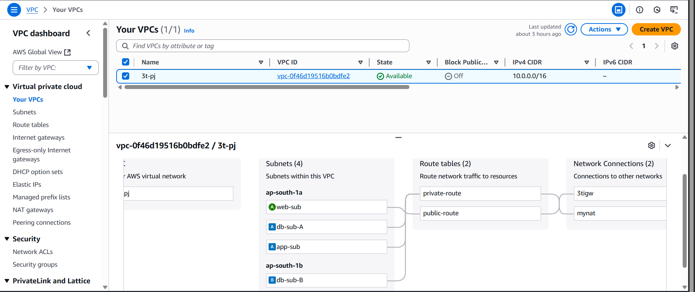
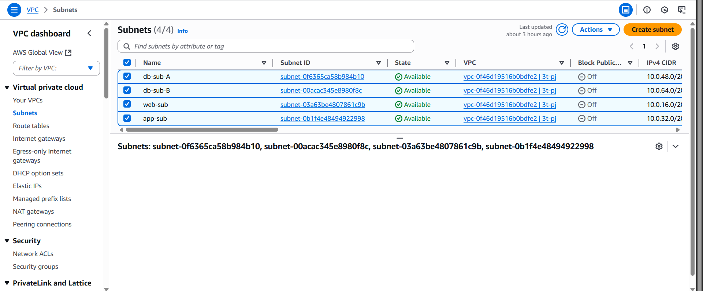
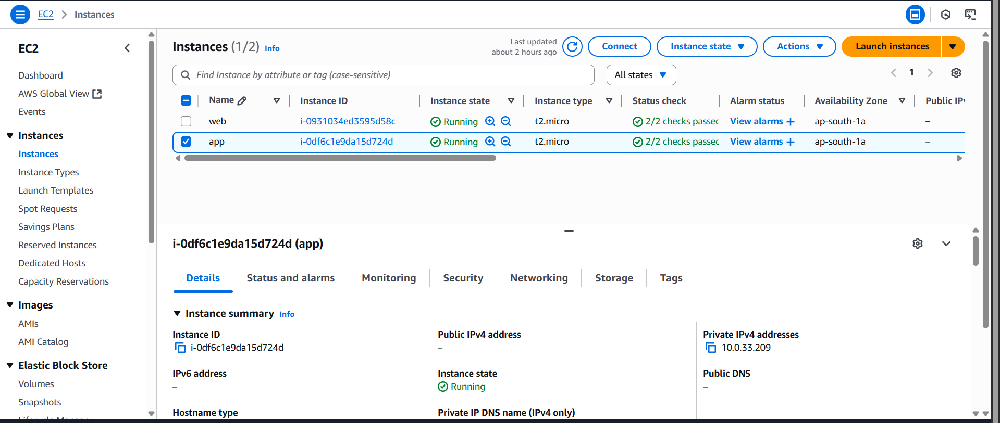
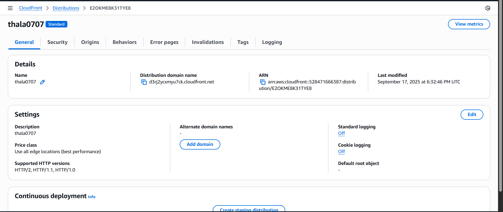
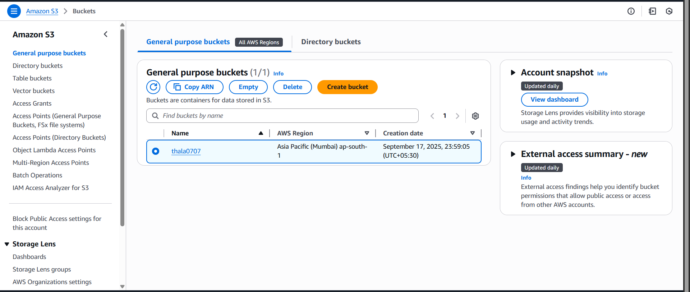
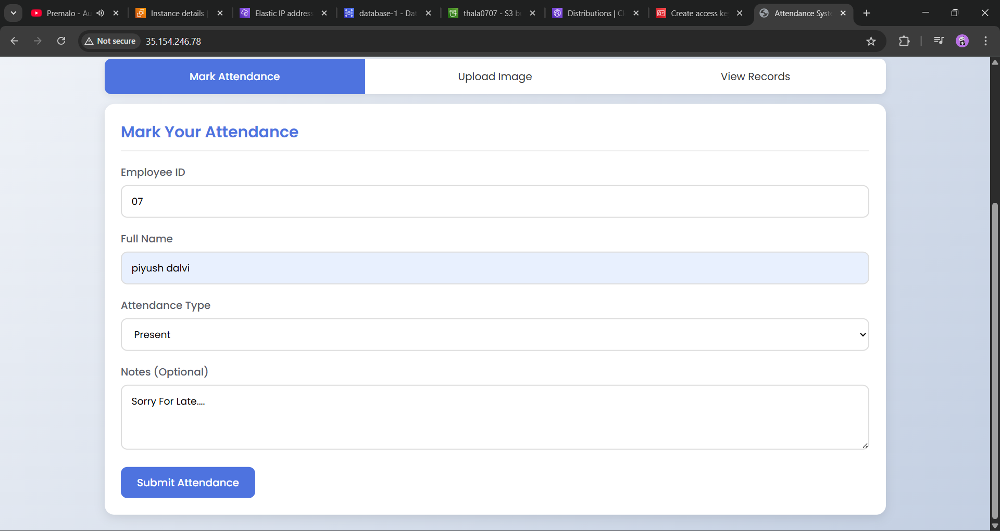

# Mark Your Attendance (3-Tier AWS SDK Architecture)

## 📌 Introduction
Mark Your Attendance is a cloud-native web application built using **AWS 3-Tier Architecture** with **AWS SDK** integration for secure, scalable, and highly available attendance management. This project demonstrates modern cloud architecture principles while providing a complete, production-ready attendance tracking system.

---

## 1. Architecture Overview


## 🏗️ 3-Tier Architecture Breakdown  

| 🏷️ Tier              | 🎯 Purpose                    | ☁️ AWS Services     | 🔧 Configuration                          |
|-----------------------|--------------------------------|---------------------|-------------------------------------------|
| **Presentation Layer** | User Interface & Static Content | Amazon S3 + CloudFront | Global CDN delivery with low latency       |
| **Application Layer**  | Business Logic & Processing    | Amazon EC2 (in VPC) | Private subnet deployment for security     |
| **Database Layer**     | Data Storage & Management      | Amazon RDS (MySQL)  | Multi-AZ deployment in private subnet      |


## AWS Infrastructure Components
###  2. 🔒 VPC Network Setup

**VPC Name:** `3t-pj`

**CIDR Block:** `10.0.0.0/16`

**Public Access:** `Enabled`



### 2.1 🌐 Subnet Configuration  

| Subnet Name | Availability Zone | CIDR Block   | Type    | Purpose              |
|-------------|-------------------|--------------|---------|----------------------|
| **web-sub** | ap-south-1a       | 10.0.18.0/24 | Public  | Web Server EC2       |
| **app-sub** | ap-south-1a       | 10.0.19.0/24 | Private | Application Server EC2 |
| **db-sub-A**| ap-south-1a       | 10.0.20.0/24 | Private | Primary Database     |
| **db-sub-B**| ap-south-1b       | 10.0.21.0/24 | Private | Secondary Database   |





### 2.2 Create Subnets

| 📝 **Subnet Name** | 🌍 **CIDR Block** | 🗺️ **Availability Zone (AZ)** | 🔐 **Type** |
|-------------------|-------------------|--------------------------------|-------------|
| **Public-Subnet** | `10.0.16.0/24`    | `ap-south-1a`                   | 🌐 **Public** |
| **Private-App**   | `10.0.32.0/24`    | `ap-south-1a`                   | 🔒 **Private** |
| **Private-DB**    | `10.0.48.0/24`    | `ap-south-1a`                   | 🔒 **Private** |
| **Private-DB-2**  | `10.0.64.0/24`    | `ap-south-1b`                   | 🔒 **Private** |
> Enable Auto-Assign Public IP for **Public Subnet**.


### 2.3 🌐 Internet Connectivity

**Internet Gateway:** `igw-09df73eb1a0b523cb (3fgw)`

**NAT Gateway:** `nat-0f7e9b4bf3270cd56 (mynat)`

**Public IP:** `13.126.192.121`


### 2.4 Create Route Tables

**Public Route Table:** `rtb-0dfb27aa45720cd6e (public-route)`

**Private Route Table:** `rtb-04bc8f91a1dfcf22b (private-route)`


## 🌐 3. 🖥️ EC2 Instances Configuration

### Web Server Instance
**Instance ID:** `i-0df5c1e9da15d724d`

**Name:** `web`

**Instance Type:** `t2.micro`

**Status:** `Running (2/2 checks passed)`

**Availability Zone:** `ap-south-1a`

**Subnet:** `web-sub (Public)`

### Application Server Instance

**Instance ID:** `i-0@3103ded3596d58c`

**Name:** `app`

**Instance Type:** `t2.micro`

**Status:** `Running (2/2 checks passed)`

**Availability Zone:** `ap-south-1a`

**Subnet:** `app-sub (Private)`



## Database Configuration (RDS MySQL)

### Database Details

**DB Identifier:** `database-1`

**Engine:** `MySQL Community`

**Instance Class:** `db.t4g.micro`

**Status:** `Available`

**Endpoint:** `database-1.<tqc@eee05s.ap-south-1.rds.amazonaws.com`

**Port:** `3306`

**Availability Zone:** `ap-south-1a`

### Security & Connectivity

**VPC:** `vpc-0f46d19516b0bfe2 (3t-pj)`

**Subnet Group:** `subgroup`

**Publicly Accessible:** `No`

**Security Group:** `default (sg-03s55285526293af)`


## ☁️ CloudFront & S3 Configuration

### CloudFront Distribution

**Distribution Name:** `thala0707`

**Domain Name:** `d3475vxmyu7dc.cloudfront.net`

**ARN:** `arn:aws:cloudfront:528471666387:distribution/E2OKMESK31TYE8`

**Price Class:** `All Edge Locations (Best Performance)`



### S3 Bucket
**Bucket Type:** `General Purpose`

**Region:** `ap-south-1 (Mumbai)`

**Purpose:** `Static website hosting for frontend assets`




## 🎯 Application Features

### Attendance Management

**Employee ID input validation**

**Full name capture**

**Attendance type selection (Present/Absent/Late)**

**Optional notes field for explanations**

**Secure form submission**

**Upload Image**

**Notes**

**View Records**




## User Interface

**Responsive web design**

**Simple and intuitive form layout**

**Real-time validation feedback**

**Success confirmation messages**


## Data Storage

**Secure employee attendance records**

**Timestamp tracking**

**Attendance type categorization**

**Optional notes storage**

## 🔒 Security Implementation

### Network Security

**VPC isolation with public and private subnets**

**Security groups with least privilege access**

**NAT Gateway for private instance internet access**

**No direct public access to application and database layers**

### Data Protection

**Database deployed in private subnet**

**No public accessibility for RDS instance**

**Encrypted data transmission**

**IAM role-based access control**

### Access Control

**AWS SDK integration with secure credentials**

**Programmatic access management**

**Secure API endpoints**

## 🚀 **Deployment Architecture**

```bash
Internet User
    ↓
CloudFront (CDN)
    ↓
S3 Bucket (Static Content)
    ↓
Internet Gateway
    ↓
Public Subnet (Web Server EC2)
    ↓
NAT Gateway
    ↓
Private Subnet (App Server EC2)
    ↓
Private Subnet (RDS MySQL)
```
## 📊 Monitoring & Maintenance

### Instance Monitoring

**Both EC2 instances show "2/2 checks passed"**

**CloudWatch integration for metrics**

**Regular health checks**

## Database Management

**Automated backups**

**Multi-AZ deployment readiness**

**Performance monitoring**

## Content Delivery

**Global CDN via CloudFront**

**S3 versioning and lifecycle policies**

**Cache optimization**

## 💡 Best Practices Implemented

## Architecture

**Proper 3-tier separation**

**Multi-AZ deployment capability**

**Auto-scaling readiness**

**Load balancing preparation**

## Security

**Network segmentation**

**Least privilege access**

**Private database deployment**

**Secure credential management**

## Performance

**CDN implementation**

**Caching strategies**

**Database connection pooling**

**Optimized instance types**

## 🎯 Usage Example

### Sample Attendance Entry:

**Employee ID:** `07`

**Full Name:** `Piyush Daivi`

**Attendance Type:** `Present`

**Notes:** `Sorry For Late...`


# 🔧 Technical Stack

## Frontend

**HTML5, CSS3, JavaScript**

**Responsive web design**

**AWS SDK for JavaScript**

## Backend
**EC2-based application server**

**AWS SDK integration**

**MySQL database connectivity**


## Infrastructure

**AWS VPC, EC2, RDS, S3, CloudFront**

**IAM for access management**

**Route53 for DNS (if configured)**

## 🏗️ Core Architecture

### Three-Tier Design Pattern

```bash
🌐 Presentation Layer (Frontend) → S3 + CloudFront
    ↓
⚡ Application Layer (Business Logic) → EC2 in Private Subnet
    ↓
🗄️ Database Layer (Persistence) → RDS MySQL in Private Subnet
```
### Key Infrastructure Components

**VPC Network:** `3t-pj` with public and private subnets across multiple AZs

**Compute:** EC2 instances (Web & App servers) with proper segmentation

**Database:** RDS MySQL instance with high availability configuration

**Content Delivery:** CloudFront CDN with S3 origin for static assets

**Security:** NAT Gateway, Security Groups, and private subnet isolation


## 📊 Project Status

### Current Implementation

✅ VPC and subnet configuration completed

✅ EC2 instances deployed and running

✅ RDS MySQL database operational

✅ CloudFront distribution active

✅ S3 bucket configured for static hosting

✅ Basic attendance form functional

## Infrastructure Health

EC2 Instances: 2/2 status checks passed

RDS Database: Available and accessible

Network: All components properly connected

Security: Least privilege access enforced

## 🎯 Conclusion

**Mark Your Attendance successfully demonstrates a production-ready cloud application built on AWS 3-Tier Architecture. The project showcases:**

✅ Enterprise-grade security through proper network segmentation

✅ High availability with multi-AZ deployment capabilities

✅ Scalability through cloud-native architecture patterns

✅ Cost optimization using managed AWS services

✅ Modern development practices with SDK integration

**This project serves as both a functional attendance management system and an educational example of AWS cloud architecture best practices, ready for production deployment and future enhancements.**#